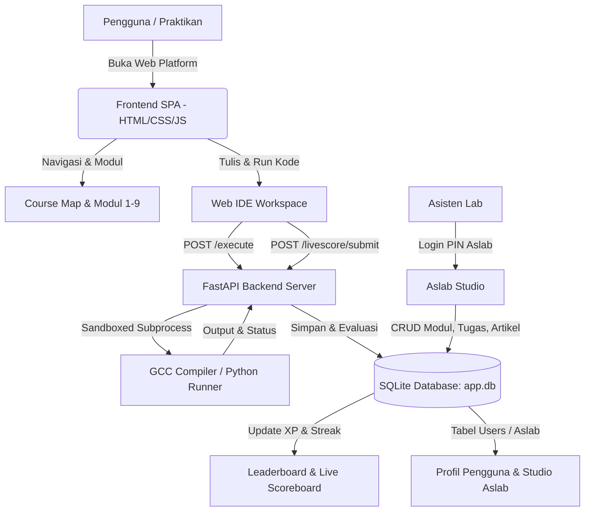

<div align="center">

# 💻 CODELAB IF'25 | PLATFORM PRAKTIKUM PEMROGRAMAN
### *Laboratorium Rekayasa Perangkat Lunak & Sistem Informasi — Informatika USK 2025*

[](https://fastapi.tiangolo.com/)
[](https://www.python.org/)
[](https://gcc.gnu.org/)
[](https://www.sqlite.org/)
[](https://ocw.mit.edu/)

<br/>

**Codelab IF'25** adalah platform pembelajaran dan praktikum interaktif berbasis web untuk mahasiswa Jurusan Informatika Universitas Syiah Kuala (USK). Platform ini menggabungkan Web IDE, kurikulum modul terstruktur, sistem evaluasi otomatis (*auto-grader*), papan peringkat (*leaderboard*), pemantauan *live score*, dan manajemen studio bagi Asisten Laboratorium (Aslab).

---

</div>

## 📑 Daftar Isi
1. [Fitur Utama](#-fitur-utama)
2. [Alur Kerja Sistem (Workflow Architecture)](#-alur-kerja-sistem)
3. [Teknologi yang Digunakan](#-teknologi-yang-digunakan)
4. [Panduan Instalasi & Menjalankan](#-panduan-instalasi--menjalankan)
5. [Daftar Akun & Kredensial](#-daftar-akun--kredensial)
6. [Struktur Direktori Proyek](#-struktur-direktori-proyek)
7. [Komunitas & Referensi](#-komunitas--referensi)

---

## 🌟 Fitur Utama

### 1. ⚡ Integrated Web IDE (C & Python)
- **Compiler Sandboxed**: Eksekusi kode C (GCC) dan Python 3 secara *real-time* langsung dari peramban.
- **Terminal Interaktif**: Menampilkan output eksekusi, error runtime, serta waktu eksekusi (*execution time* dalam milidetik).
- **Split Workspace & Scratchpad**: Dilengkapi area coret-coret / catatan koding pribadi di sisi kiri editor.
- **Auto Submission**: Tombol **`🚀 Submit Tugas`** untuk langsung mengevaluasi tugas praktikum dan mengirim skor ke papan nilai.

### 2. 🗺️ Interactive Course Map & 9 Modul Resmi
Kurikulum praktikum pemrograman Semester 1 terstruktur lengkap:
1. **Modul 1**: Pengantar Bahasa C, Struktur Dasar & `printf()`
2. **Modul 2**: Tipe Data Dasar, Format Specifier & `scanf()`
3. **Modul 3**: Struktur Kendali Kondisional (`if`, `else-if`, `switch-case`)
4. **Modul 4**: Perulangan / Looping (`for`, `while`, `do-while`)
5. **Modul 5**: Array 1-Dimensi & 2-Dimensi
6. **Modul 6**: Fungsi (Function, Passing by Value & Reference)
7. **Modul 7**: Konsep Pointer & Manajemen Alamat Memori
8. **Modul 8**: Struktur Data `struct` & Typedef
9. **Modul 9**: File Handling (Membaca & Menulis File `.txt` / `.dat`)

### 3. 🏆 Leaderboard & ⚡ Live Score Real-time
- **Hall of Fame Podium**: Menampilkan 3 peringkat teratas (Juara 🥇 Emas, 🥈 Perak, 🥉 Perunggu).
- **Klasemen XP**: Tabel ranking mahasiswa berdasarkan akumulasi XP dan pencapaian modul.
- **Live Scoreboard Tugas**: Feed langsung yang menampilkan nilai dan status evaluasi tugas (*PASSED/FAILED*) secara *real-time* saat sesi praktikum berlangsung.
- **Pencarian Cepat**: Fitur pencarian instan nama atau NIM mahasiswa.

### 4. 👑 Aslab Studio (Multi-Akun Dinamis dengan Hak Akses Setara)
- 3 Akun resmi Aslab yang tersimpan dinamis di database SQLite (`app.db`).
- **Hak akses penuh dan setara**: Setiap Aslab dapat mengelola seluruh konten tanpa pembatasan:
  - 📚 **Kelola Modul**: Tambah, edit, dan hapus modul kurikulum.
  - 📝 **Kelola Tugas**: Tambah, edit, dan hapus tugas praktikum.
  - 📖 **Kelola Artikel**: Terbitkan dan edit artikel teori penunjang.
  - 📊 **Submissions & Logs**: Audit log eksekusi dan riwayat submit mahasiswa.

### 5. 📖 Artikel Teori & Referensi Kurikulum MIT OCW
- Artikel teori mendalam yang terhubung dengan silabus standar internasional:
  - [MIT 6.S096: Introduction to C and C++ (IAP 2013)](https://ocw.mit.edu/courses/6-s096-introduction-to-c-and-c-january-iap-2013/)
  - [MIT 6.087: Practical Programming in C (IAP 2010)](https://ocw.mit.edu/courses/6-087-practical-programming-in-c-january-iap-2010/pages/syllabus/)

### 6. 💬 Live Chat Tanya Aslab
- Kotak percakapan interaktif untuk bertanya seputar kendala koding, petunjuk praktikum, dan *compiler error* langsung ke Aslab yang bertugas.

### 7. 🎨 Kustomisasi Profil Pengguna
- Kustomisasi foto profil / avatar emoji.
- Kustomisasi tema banner profil (*Cyber Neon, Matrix Green, Synthwave, Deep Space, Cyan, atau URL gambar kustom*).
- Indikator Level, XP, dan Streak aktivitas harian.

---

## 📐 Alur Kerja Sistem



---

## 🛠️ Teknologi yang Digunakan

- **Backend**: Python 3, FastAPI, Uvicorn, Pydantic, SQLite3
- **Frontend**: Vanilla HTML5, Vanilla CSS3 (Custom Cyber Neon Design System, Glassmorphism), Modern JavaScript (ES6+ SPA)
- **Compiler / Executor**: GCC (`gcc -O2`) & Python 3.9+ Subprocess Execution
- **Font & Icon**: Orbitron, JetBrains Mono, Inter, Boxicons / Custom SVGs

---

## 🚀 Panduan Instalasi & Menjalankan

### Prasyarat:
1. **Python 3.9+** terpasang di sistem ([Unduh Python](https://www.python.org/downloads/))
2. **GCC Compiler** (MinGW untuk Windows atau `build-essential` untuk Linux/Mac)

### Langkah-langkah:

1. **Clone Repository**:
   ```bash
   git clone https://github.com/Eruumaa/Codelab.git
   cd Codelab
   ```

2. **Buat & Aktifkan Virtual Environment** (Opsional tapi disarankan):
   ```bash
   # Windows
   python -m venv .venv
   .venv\Scripts\activate

   # Linux / macOS
   python3 -m venv .venv
   source .venv/bin/activate
   ```

3. **Install Dependensi**:
   ```bash
   pip install -r requirements.txt
   ```

4. **Jalankan Server Codelab**:
   ```bash
   python -m uvicorn main:app --host 127.0.0.1 --port 8000 --reload
   ```

5. **Buka di Browser**:
   Buka [http://127.0.0.1:8000](http://127.0.0.1:8000) pada peramban web Anda.

---

## 🔑 Daftar Akun & Kredensial

### 1. Akun Asisten Laboratorium (Aslab)
Ketiga akun memiliki hak akses administrasi penuh ke Aslab Studio:

| Akun ID | Nama Akun | NIM / ID | PIN Akses | Avatar |
| :--- | :--- | :--- | :--- | :--- |
| `aslab_1` | **Aslab 1 IF'25** | `ASLAB-01` | **`1928`** | 👑 |
| `aslab_2` | **Aslab 2 IF'25** | `ASLAB-02` | **`2525`** | ⚡ |
| `aslab_3` | **Aslab 3 IF'25** | `ASLAB-03` | **`2025`** | 🛡️ |

> *Catatan: Akun Aslab juga dapat login menggunakan PIN cadangan `aslab2025`.*

### 2. Akun Mahasiswa / Praktikan
- Mahasiswa baru dapat mendaftar langsung melalui tombol **`+ Register`** pada header navigasi.
- Mahasiswa terdaftar dapat login menggunakan **NIM** atau **Username**.

---

## 📁 Struktur Direktori Proyek

```
Codelab/
├── Assets/                 # Aset grafis, GIF animasi, dan logo platform
├── Important/              # Dokumentasi desain dan spesifikasi
├── Materials/              # Modul praktikum dan tautan referensi kurikulum
├── app.db                  # Database SQLite (Users, Materials, Assignments, dll.)
├── app.js                  # Frontend SPA Logic & Controller
├── Dockerfile              # Konfigurasi container Docker
├── executor.py             # Modul sandbox compiler & interpreter
├── index.html              # Template antarmuka web utama
├── main.py                 # Backend API Server (FastAPI)
├── README.md               # Dokumentasi resmi proyek
├── requirements.txt        # Daftar dependensi Python
└── style.css               # Desain UI Cyber Neon & Glassmorphism
```

---

## 🌐 Komunitas & Referensi

- **Instagram Informatika USK 2025**: [@informatikausk25](https://www.instagram.com/informatikausk25/)
- **Discord Community**: [Join Discord Server](https://discord.gg/2PFA7kBJcj)
- **Kurikulum Referensi MIT**:
  - [MIT 6.S096 - Introduction to C and C++](https://ocw.mit.edu/courses/6-s096-introduction-to-c-and-c-january-iap-2013/)
  - [MIT 6.087 - Practical Programming in C](https://ocw.mit.edu/courses/6-087-practical-programming-in-c-january-iap-2010/pages/syllabus/)

---

<div align="center">
  <sub>Dikembangkan dengan ❤️ untuk Praktikum Pemrograman Informatika USK Angkatan 2025.</sub>
</div>
